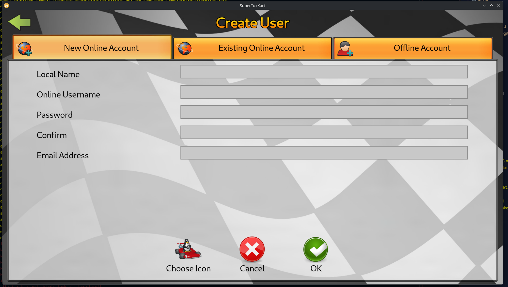

# Semana 5

## 23/9

- Começando a quinta semana, com pretenções de finalmente por a mão em código, me surgiu uma breve insegurança sobre como dar seguimento na issue #1771 em específico, meu medo foi: "E se alguém atuar na issue ao decorrer do semestre, no meio do meu desenvolvimento?".
- Com isso, me senti na liberdade de ir clamar a issue para que eu me tornasse o assignee, e não correr o risco acima, então deixei um [comentário](https://github.com/supertuxkart/stk-code/issues/1771#issuecomment-5799971261) lá:
  > Hello, I'm an Information Systems student at the University of São Paulo (USP) taking a Free Software Lab course, and I’d like to tackle this issue for my contribution. <br>
  > I aim to start with local profiles, building on top of the STK Evolution branch, allowing the player to choose a kart icon as their avatar in the profile settings or upload one that they chooses. <br>
  > If no one is actively working on it, could you please assign it to me? Thanks! <br>

- E em cerca de 5 minutos, um contribuinte do projeto deixou uma [resposta](https://github.com/supertuxkart/stk-code/issues/1771#issuecomment-5800055301) (inusitada XD) sobre:
  > Well, I just do my code by myself (without any assignment), and do a pull request and pray to the leader developer accepts ;) <br>
  > But that's good (depending of the improvement level) talk about this in forum.supertuxkart.net. <br>
  > PS: Sou Brasileiro também :) (mais daora ainda que também sou de São Paulo kkkk) <br>

- Com isso, posso concluir que querendo ou não, o caminho está aberto para minha contribuição haha!

- Decidi fracionar meus objetivos em pequenas entregas, para formar melhor as ideias de como seguir e tornar os PRs mais aceitáveis
- Objetivos fracionados:
  1. Na hora de criação de perfil (estritamente) permitir que o jogador escolha um ícone dos já existentes
  2. Na hora de criação de perfil (estritamente), adicionar a função de fazer o upload de ícone, além dos já existentes
  3. A qualquer hora, poder editar o ícone de perfil (já existente ou adicionar um)

## 24/9

- Sobre o objetivo fracionado, cheguei nas seguintes análises com apoio do agy para conseguir cumprir o primeiro passo:

  - Expor a lista de karts/ícones
    - O STK já possui o singleton kart_properties_manager (de kart_properties_manager.hpp)
    - Esse singleton já tem a lista completa de todos os karts do jogo getAllKarts() e getNumberOfKarts()

  - Método no PlayerProfile
    - Criar um método explícito como void setIconFromKart(const std::string& kart_ident)
    - Ele busca a textura do kart escolhido via kart_properties_manager, copia para ~/.config/supertuxkart/config-0.10/<unique_id>.png e atualiza m_icon_filename

  - Desacoplar o addIcon()
    - Fazer com que o addIcon() só execute o cálculo pseudo-aleatório antigo se nenhum ícone explícito for passado, mantendo retrocompatibilidade

  - Tela de escolha do Ícone
    - Para não complicar tanto, a ideia é "apenas" criar uma tela Popup, igual a de escolha da cor do kart na tela de register_screen, e não uma nova tela completa.
    - Com isso, posso criar um KartIconSelectionDialog, um modal com uma gradezinha dos karts para clicar e confirmar

## 26/9

- Recebi o [aval](https://github.com/supertuxkart/stk-code/issues/1771#issuecomment-5840414548) do próprio [líder do projeto do STK](https://github.com/Alayan-stk-2) para seguir com a feature XD, apenas registrando aqui, pois agora não tenho mais para onde fugir, bora pro código:
  > If you want to implement the feature, that's welcome.
  > Please make sure to test your code well and to not overcomplicate things!

- Descobri também da pior forma que a branch `BalanceSTK2` não é o lugar mais ideal para trabalhar, mas sim a própria `master`, ajustei meu fork aqui.
- Tive erros de execução por falta de assets e outras dependências, então voltei pro `master`, que não é necessariamente a branch segura da ultima versao stable lançada, mas sim um checkpoint de desenvolvimento estavel!

- Com o build comp exec atualizado, fiz uns testes criando uns perfis de teste para ver o pseudo-aleatório de escolha de ícones em ação e testes de sobrescrita dos png dos ícones com id do player
- Além disso, fiz testes de inclusão de ícone quebrado e personalizado, funcionaram bem! Mas não são tranquilos para o user comum, como já tinha levantado

- O primeiro passo de código em que andei foi na GUI, na tela de deregistro de perfil, onde eu simplesmente adicionei um botão de `Choose Icon` XD
<p align="center">
   
</p>

- Para entender também como o botão se ligava com o código, fiz um simples trigger no `register_screen.cpp` de printar no terminal "Clicou em Choose Icon", e funcionou normalmente!

```cpp
// ...
    else if (name=="options")
    {
        const std::string button = m_options_widget
                                 ->getSelectionIDString(PLAYER_ID_GAME_MASTER);
        if(button=="next")
        {
            doRegister();
        }
        else if(button=="cancel")
        {
            StateManager::get()->popMenu();
            onEscapePressed();
        }
        else if (button == "choose_icon")
        {
            Log::info("RegisterScreen", ">>> CLICOU NO CHOOSE ICON! <<<");
        }
// ...
```
