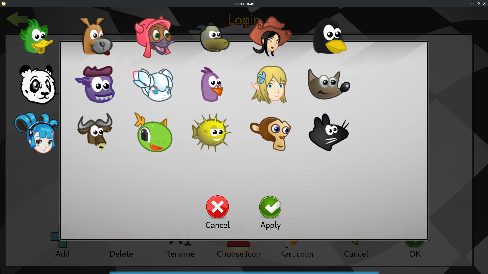

# Semana 6 - Postagem

Olá professor Daniel, tudo bem?

Registrando aqui minha atualização referente à Semana 6.

Nesta semana, dei passos muito importantes e concretos no código: fiz meu primeiro commit oficial na minha branch de trabalho e consegui finalmente dar vida ao diálogo visual que lista os ícones dos personagens dinamicamente dentro do jogo!

Principais avanços, decisões e aprendizados da semana:

- No início da semana, repensei a usabilidade e a arquitetura de onde a escolha do ícone deveria acontecer:
  - Inicialmente, eu estava tentando plugar o fluxo na tela de registro (`register.stkgui`). No entanto, percebi que faz muito mais sentido o usuário poder escolher ou alterar o ícone após criar o perfil (na tela de gerenciamento de usuário, `user_screen`), exatamente igual ao que o jogo já faz com a cor do kart (`kart_color_slider_dialog`).
  - Dessa forma, o jogo mantém o comportamento padrão de gerar um ícone pseudo-aleatório no primeiro boot sem travar o cadastro, e o usuário pode ir lá quando quiser e escolher um novo avatar.
  - Movi o botão de "Choose Icon" e seu gatilho de eventos para `user_screen.stkgui` e `user_screen.cpp`.

- Para estruturar o novo modal sem reinventar, seguindo um padrão, usei a implementação do `kart_color_slider_dialog` como referência arquitetural:
  - Criei uma versão mínima/boilerplate do modal: `icon_selection_dialog.stkgui`, `icon_selection_dialog.hpp` e `icon_selection_dialog.cpp`.
  - Fiz um teste de integração disparando o diálogo a partir do botão criado na tela de usuário para validar que o ciclo de abrir/fechar o modal funcionava de forma idêntica ao seletor de cor de kart.
  - Com essa fundação sólida e segura funcionando, fiz meu primeiro commit na branch com as alterações em:
    - `data/gui/dialogs/icon_selection_dialog.stkgui`
    - `data/gui/screens/user_screen.stkgui`
    - `src/states_screens/dialogs/icon_selection_dialog.hpp`
    - `src/states_screens/dialogs/icon_selection_dialog.cpp`
    - `src/states_screens/options/user_screen.cpp`
  - título e descrição do commit:
    -  Add 'Choose Icon' button to user screen
    -  The button triggers an empty dialog, with a boilerplate dialog (IconSelectionDialog), which will be implemented next

- Um dos maiores aprendizados da semana foi entender como o C++ e a engine gráfica do SuperTuxKart lidam com os arquivos `.stkgui` (XMLs de tela) debaixo dos panos:
  - Cada diálogo `.stkgui` tem uma classe C++ correspondente herdando de `ModalDialog`.
  - No construtor, ao chamar `loadFromFile(...)`, o STK faz o parse do XML, calcula o layout preliminar e invoca um método virtual chamado `beforeAddingWidgets()`.
  - Esse método funciona como um pré-passo preparatório indispensável: é nele que precisamos popular dados dinâmicos antes que os widgets sejam efetivamente instanciados e desenhados pelo Irrlicht.
  - Quebrei um pouco a cabeça com imports e ponteiros em C++ (lidando com forward declarations e tipos incompletos de widgets), o que me forçou a limpar os `#include` e entender melhor as dependências granulares da engine.

- Em vez de hardcodar cada botão de ícone no XML, a solução elegante e manutenível é carregar os ícones dinamicamente em tempo de execução:
  - O STK possui o singleton `kart_properties_manager`, que provê a lista de todos os karts/personagens do jogo (`getNumberOfKarts()`), seus nomes, identificadores únicos (`getIdent()`) e o caminho absoluto do ícone PNG (`getAbsoluteIconFile()`).
  - No `.stkgui`, utilizei a tag `<ribbon_grid id="kart_icons" ... />` (mapeada no C++ para a classe `DynamicRibbonWidget`), que é um container dinâmico projetado exatamente para exibir grades roláveis de botões com imagens.
  - No `beforeAddingWidgets()`, iterei sobre todos os karts do jogo para popular dinamicamente a grade:

```cpp
void IconSelectionDialog::beforeAddingWidgets()
{
    m_kart_icons = getWidget<DynamicRibbonWidget>("kart_icons");
    assert(m_kart_icons);

    m_kart_icons->clearItems();
    for(unsigned int i=0; i<kart_properties_manager->getNumberOfKarts(); i++)
    {
        const KartProperties* kp = kart_properties_manager->getKartById(i);

        if (!kp) continue;

        m_kart_icons->addItem(
            kp->getName(),
            kp->getIdent(),
            kp->getAbsoluteIconFile(),
            0,
            IconButtonWidget::ICON_PATH_TYPE_ABSOLUTE
        );
    }
}
```

- A estrutura do XML do diálogo ficou assim:

```xml
<?xml version="1.0" encoding="UTF-8"?>
<stkgui>
    <div x="2%" y="0%" width="96%" height="95%" layout="vertical-row">
        <spacer height="20" width="10"/>
        <div layout="horizontal-row" width="100%" proportion="1" align="center">
            <ribbon_grid id="kart_icons" height="100%" width="100%" align="center"
                        square_items="true" child_width="96" child_height="96" />
        </div>
        <spacer height="10" width="10"/>
        <buttonbar id="buttons" height="20%" width="30%" align="center">
            <icon-button id="cancel" width="128" height="128" icon="gui/icons/red_x.png"
                I18N="In the kart color slider dialog" text="Cancel" align="center"/>
            <icon-button id="apply" width="128" height="128" icon="gui/icons/green_check.png"
                I18N="In the kart color slider dialog" text="Apply" align="center"/>
        </buttonbar>
    </div>
</stkgui>
```

### 5. Resultado Visual e Próximos Passos
- Com essa lógica, o diálogo finalmente ganhou vida na tela do jogo, renderizando os rostos dos personagens em uma grade!

<p align="center">
   
</p>

- Portanto, a renderização dos ícones já está funcionando! Mas a grade ainda está com pequenos desalinhamentos visuais e falta implementar a usabilidade real dos widgets.

- Próximos passos para a Semana 7:
  1. Fazer o ajuste fino de layout no XML do diálogo para deixar a grade perfeitamente centralizada e proporcional.
  2. Implementar o evento de clique/seleção: capturar qual kart o jogador clicou no `DynamicRibbonWidget`.
  3. Criar a função no `PlayerProfile` para copiar a textura selecionada para a pasta local de configuração (`~/.config/supertuxkart/config-0.10/<id>.png`) ao clicar em "Apply", completando de ponta a ponta o primeiro objetivo da issue!
